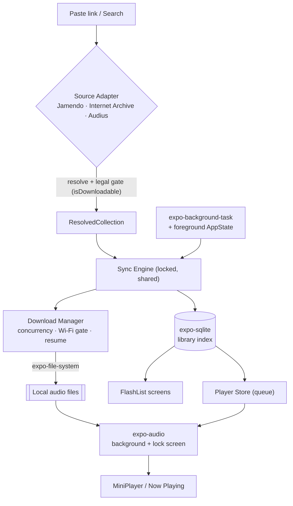

<div align="center">


# 🎧 Crate

**An offline-first React Native music player for Creative Commons & public-domain music.**

Paste a link, download an entire playlist at the best available quality, keep it auto-synced, and play it anywhere — fully offline, no account, no tracking.

<br />

[](https://github.com/aashir-athar/crate/stargazers)
[](./LICENSE)
[](https://github.com/aashir-athar/crate/commits)
[](https://github.com/aashir-athar/crate)
[](https://github.com/aashir-athar/crate)

[](https://expo.dev)
[](https://reactnative.dev)
[](https://reactnative.dev/architecture/landing-page)
[](#-getting-started)
[](#-contributing)

<a href="#-getting-started"><strong>Getting Started</strong></a> ·
<a href="#-how-it-works"><strong>How It Works</strong></a> ·
<a href="https://github.com/aashir-athar/crate/issues"><strong>Report Bug</strong></a> ·
<a href="https://github.com/aashir-athar/crate/issues"><strong>Request Feature</strong></a>

</div>

---

**Crate** is a beautiful, offline-first music player for legally-downloadable music. It gives you the experience you actually want — *paste a link, download everything, play it offline* — pointed at catalogs that **permit downloading**: Jamendo, the Internet Archive, and Audius. Built with **Expo SDK 56**, **React Native** (New Architecture), and **strict TypeScript**, Crate stores your entire library in on-device SQLite and local files — no login, no streaming-only lock-in, no tracking.

---

## ⚖️ Built Legal, by Design

Crate is a **stream-ripper-free** music app. It never touches Spotify's catalog, never scrapes YouTube, and never downloads anything a rights holder hasn't allowed. Instead, it points the exact experience you want at catalogs that **legally permit downloading**:

| Source | What It Offers | Auth |
| ------ | -------------- | ---- |
| **Jamendo** | ~600k curated Creative Commons tracks with an explicit per-track download flag | Free `client_id` |
| **Internet Archive** | Millions of public-domain & CC audio items, direct downloads | None |
| **Audius** | Open artist platform, restricted to *downloadable + permissively-licensed* tracks | None |

Every download decision is made by a **source adapter** that reads the track's actual license (`audiodownload_allowed`, `licenseurl` + `stream_only`, `is_downloadable`) before a single byte is written. Stream-only tracks can still play — they just never get saved. Crate surfaces each track's Creative Commons license and attribution so you can honor it.

> Crate is a personal, offline music player for openly licensed music. Please respect each track's license, including attribution where required.

---

## ✨ Features

| | Feature | Description |
|---|---|---|
| 🔗 | **Paste-link import** | Drop a Jamendo, Internet Archive, or Audius playlist/album URL — Crate detects the source, previews the tracklist, and shows exactly which tracks are downloadable. |
| ⬇️ | **Auto-download at best quality** | Resumable downloads (MP3 / OGG / FLAC where offered), concurrency-limited, with optional **Wi-Fi-only** mode and live progress. |
| 🔄 | **Auto-sync** | Crates re-check for new tracks in the background and on launch; new tracks download automatically, removed tracks are pruned, files cleaned up. |
| 🎵 | **Full-featured player** | Play/pause, skip, scrubbable seek bar, shuffle, repeat, live queue, artwork, plus **background playback + lock-screen controls**. |
| 📴 | **Truly offline & account-free** | Your library lives in on-device SQLite + local files. No login, ever. |
| 🎨 | **Crafted UI** | Token-driven theming with **Light / Dark / OLED** modes, shimmer skeletons (never spinners), and reduced-motion support. |

---

## 🛠️ Tech Stack

| Layer | Choice | Why |
| ----- | ------ | --- |
| Framework | **Expo SDK 56**, expo-router, React Native 0.85 (New Arch) | Latest, file-based routing, typed routes |
| Language | **TypeScript** (strict) | Zero `any`, fully typed data model |
| Audio | **expo-audio** + app-level queue | First-party, New-Arch native, background + lock screen |
| Storage | **expo-sqlite** (library index) + **AsyncStorage** (settings/cache) | Relational queries at scale; KV for the rest |
| Files | **expo-file-system** (`File` / `Directory` / `Paths`) | Resumable downloads, sandbox-safe relative paths |
| Sync | **expo-background-task** + expo-task-manager | Current background API (not deprecated background-fetch) |
| Data fetching | **TanStack Query** (AsyncStorage-persisted) | Caching that respects source rate limits |
| State | **Zustand** | Player, downloads, sync, settings stores |
| Lists | **@shopify/flash-list** v2 | Recycled rendering for thousands of tracks |
| Styling | **react-native-unistyles** v3 | C++-fast tokens, themes, variants |
| Animation | **react-native-reanimated** | Shimmer skeletons & micro-interactions |

---

## 🚀 Getting Started

> [!IMPORTANT]
> Crate uses native modules (`expo-audio`, `expo-sqlite`, `expo-background-task`), so it **cannot run in Expo Go**. You need a custom **dev client** — `npx expo run:*` builds one for you.

### Prerequisites

- **Node.js** 20+
- For **iOS**: macOS + Xcode · For **Android**: Android Studio + a device/emulator

### 1. Clone & install

```bash
git clone https://github.com/aashir-athar/crate.git
cd crate
npm install
```

### 2. Add a free Jamendo client ID *(optional but recommended)*

Internet Archive and Audius work with **no key**. To use **Jamendo**, grab a free `client_id` at [devportal.jamendo.com](https://devportal.jamendo.com) and paste it into **Settings → Jamendo client ID** inside the app (or copy `.env.example` to `.env.local`). Nothing is hard-coded, so the repo never ships someone else's key.

### 3. Run on a device

```bash
# Android
npx expo run:android

# iOS (macOS only)
npx expo run:ios
```

> Background sync and lock-screen playback only behave fully on a **physical device** — simulators don't run background tasks.

---

## 📖 Usage

1. **Open the Import tab** and paste a Jamendo, Internet Archive, or Audius playlist/album link.
2. Crate **resolves the source**, previews the tracklist, and flags which tracks are legally downloadable.
3. Downloadable tracks **queue automatically** and download at the best available quality.
4. Your crate stays **in sync** — new tracks appear automatically on launch and in the background.
5. Tap any track to **play offline**, with full lock-screen and background controls.

---

## 🔍 How It Works

- **Import** → an adapter resolves your URL into a `ResolvedCollection`, gating each track's `isDownloadable` from its real license. Downloadable tracks are queued automatically.
- **Download** → the manager pulls files with `expo-file-system` resumable tasks, validates them (no 0-byte files), and stores only **relative** paths (so they survive iOS reinstalls).
- **Sync** → one shared, lock-guarded routine diffs the remote playlist against your local index — adding new tracks, removing deleted ones — triggered by the OS in the background and reliably on every app launch/resume.
- **Play** → a Zustand-managed queue drives a single `expo-audio` player; downloaded tracks play from disk, others stream, and now-playing metadata flows to the lock screen.

<details>
<summary><strong>📐 Architecture diagram</strong></summary>



**Principle:** source adapters are the *only* place that talks to a remote catalog and the *only* place that decides legality. Everything downstream is source-agnostic.

</details>

<details>
<summary><strong>🗂️ Project structure</strong></summary>

```
crate/
├─ src/
│  ├─ app/                  # expo-router routes
│  │  ├─ (tabs)/            # Library · Crates · Search · Downloads · Settings
│  │  ├─ import.tsx         # paste-link modal
│  │  ├─ player.tsx         # Now Playing
│  │  ├─ queue.tsx
│  │  ├─ collection/[id].tsx
│  │  └─ track/[id].tsx
│  ├─ sources/              # SourceAdapter interface + Jamendo/IA/Audius + legal gating
│  ├─ db/                   # expo-sqlite schema + repositories + reactivity
│  ├─ download/             # resumable download manager + filesystem
│  ├─ sync/                 # sync engine (background + foreground)
│  ├─ player/               # expo-audio service + queue store
│  ├─ tasks/                # background-task registration
│  ├─ storage/              # query client + settings store
│  ├─ theme/                # Unistyles tokens + themes
│  ├─ ui/                   # primitives (Text, Button, Skeleton, …)
│  └─ components/           # TrackRow, MiniPlayer, CollectionCard, …
└─ app.json
```

</details>

---

## ❓ FAQ

<details>
<summary><strong>Can I download my Spotify playlists?</strong></summary>

No — and that's intentional. Downloading Spotify's catalog (or ripping it from YouTube) is copyright infringement. Crate gives you the same *experience* using catalogs that legally allow downloads. You can search for Creative Commons alternatives by name, but Crate will never rip commercial tracks.

</details>

<details>
<summary><strong>Why won't it run in Expo Go?</strong></summary>

Crate relies on native modules (audio, SQLite, background tasks) that Expo Go doesn't bundle. Build a free dev client with `npx expo run:android` / `run:ios`.

</details>

<details>
<summary><strong>Is the music really free to keep?</strong></summary>

Yes, within each track's license. Crate only downloads tracks whose license permits it and shows you the Creative Commons terms (attribution, non-commercial, etc.) so you can comply.

</details>

<details>
<summary><strong>Where are my downloads stored?</strong></summary>

In the app's document directory on your device, indexed in a local SQLite database. Nothing leaves your phone.

</details>

---

## 🗺️ Roadmap

- [ ] Custom display & body fonts (typography tokens are already swappable)
- [ ] Gapless playback via a native queue option
- [ ] Per-track quality re-download
- [ ] Sleep timer & playback speed
- [ ] Crate sharing / export-import of crate lists
- [ ] Home-screen "recently added" & smart shuffle

---

## 🤝 Contributing

Contributions are welcome — whether it's a new license-clean source adapter, a UI polish, or a bug fix.

1. Fork the repo & create a branch (`git checkout -b feat/your-thing`)
2. Keep it strict-TypeScript clean (`npx tsc --noEmit`)
3. Commit, push, and open a PR describing the change

Please keep Crate's core principle intact: **only sources that legally permit downloading.**

---

## 📄 License

Distributed under the **MIT License**. See [LICENSE](./LICENSE) for details.

> Music belongs to its creators. Crate is a player — the artists and their Creative Commons / public-domain licenses make the music free.

---

## 👤 Author

**Aashir Athar**

[](https://github.com/aashir-athar)
[](https://www.linkedin.com/in/aashirathar/)
[-aashirathar-000000?style=for-the-badge&logo=x&logoColor=white)](https://x.com/aashirathar)

<div align="center">

<br />

**If Crate helped you build your offline music library, consider leaving a ⭐**

<sub>Built with ❤️ by <a href="https://github.com/aashir-athar">aashir-athar</a></sub>

<br /><br />

<sub><b>Keywords:</b> offline-first music player · React Native · Expo SDK 56 · TypeScript · Creative Commons music · public-domain audio · Jamendo · Internet Archive · Audius · offline music app · iOS · Android · background playback · expo-audio · expo-sqlite</sub>

</div>
